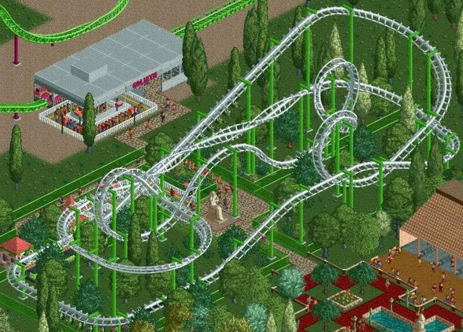
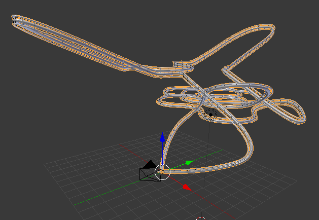
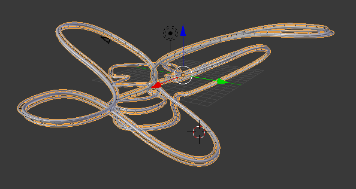
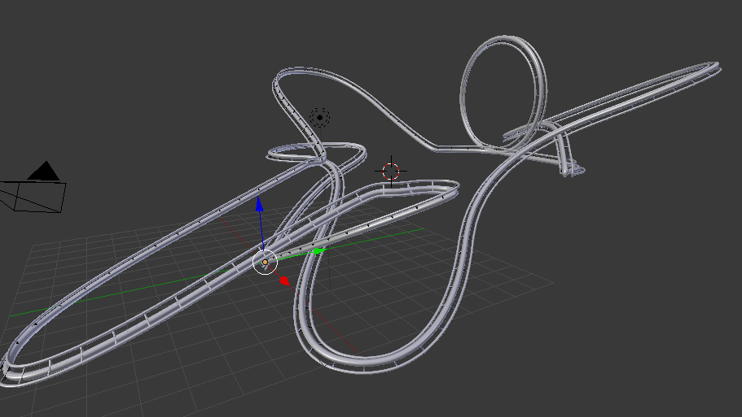

 
(_Image from RollerCoaster Tycoon 2_)

## Title and Summary

Roller coaster built with stochastic L-systems. The idea is to have a functional procedurally generated roller coaster, using predefined rules and symbols. We chose the algorithm to be stochastic so that we can have some variations. A path will be generated that goes through a set of generated 3D points and a rail segment will be repeated and curved along the path to be the final track.

## Goals and Deliverables

This is the updated proposal after discussion with one teaching assistant and the feedback that said we should rather use L-Systems instead of the wave function collapse algorithm.

The minimum deliverable for a passing grade (4.0) would be fully connected and realistic roller coaster. "Realistic" means a track that is close to a real one and that *could* be realized. I.e the roller coaster loops and have somewhat realistic curves.

1. The first extension is the ability to "ride" the roller coaster. That means setting up a camera that follows the track (a bezier curve) from start to end in order to generate a video.
2. Procedurally assign twisting speeds to certain sections of the roller coaster. Namely stunts similar to looping but the rotation axis it the track's axis.
3. The second extension is to control the twisting of the rails such that they turn more depending on the speed of the wagon. The twisting should be computed to cancel the centrifugal force, i.e. the passengers should remain on their seats.

## Milestone deliverable
### Summary
We are now able to generate a simple procedural Roller Coaster that loops. Our L-System rules do not break this loop and we could run our algorithm to an arbitrary large number of iterations without breaking this property.

We have a simple interface in Blender that allows the user to select the number of iterations that the L-System will compute.
We are currently experimenting on new rules that will make the Roller Coaster less dense on a bigger number of iterations and maybe have a less consistent "style".

### Preliminary results
Third example, with 3 iterations.

Third example, with 3 iterations.

Third example, with 2 iterations.

Third example, as a video, to have better 3d perception of the tracks. 3 iterations.

## Updated schedule
- 29/04 : Fully understand the algorithm and gather some ideas on how to implement it in `Blender` + readings and understanding of external ressources.

- 06/05 : Implementation of a simple L-system in python + some basic curve in `Blender`.

- 16/05 : Functionnal rollercoaster track (the goal of the grade 4.0).

- 26/05 : Finish both extensions.

- 28/05 : Finish the presentation video.

- 31/05 : Finish webpage (final report) of the project.

- 01/06 : Finally sell the final product to DisneyLand.

## Resources

`Blender` to create the track, and to render the final scene.

`Python` to code the algorithm for Blender.

Assignment 8 of the course.

http://pcgbook.com/
https://ieeexplore.ieee.org/document/8627334
https://docs.blender.org/api/2.79/
