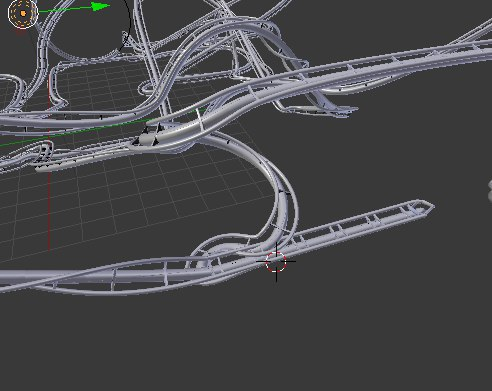
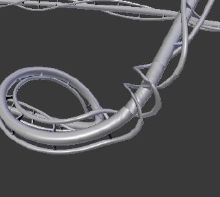
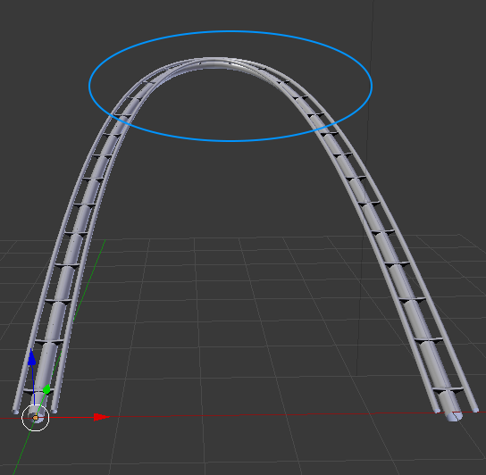
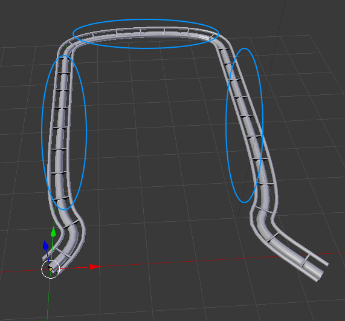

# Final Report Group 19
## Abstract
We implemented a 3D stochastic L-System procedural roller coaster as a Blender addon. The addon lets the user choose the number of iterations of the L-System and toggle the realistic twisting of the tracks. In addition to that there is a button that performs the next iteration of the L-System (without having to recompute everything from scratch).

## Technical Approach
### Summary
The use of an L-System to build a somewhat realistic roller coaster made us compute a few technical implementations.

Firstly, we obviously needed a L-System, which we originally took from the assignment 8 of the course and translated it in python. To compute it in 3 dimensions, we have implemented different symbols for each possible angle ($\pm$ vertical and $\pm$ horizontal). In addition to that, we needed some symbol to compute the distance that the line will have to travel, depending on the original angles.

Then, we wanted to have a stochastic system, so that we could have different result each time. So we added a parameter to the symbols that give the probability to be chosen at the next iteration (we have to be careful that probabilities sum to 1!). However, not every symbol has to be stochastic (for example angles, fixed lengths, etc), so that we can build predefined rules and have a track that doesn't get messed up. Those rules are predefined lists of symbols, that are used to have control on the way the L-System evolve. Furthermore, with these rules we can compute some more complex elements such as looping that would be virtually impossible to achieve with only simple rules.

Because the rules where made by us we had complete control over what they had to look like. The main challenge was to start with a track that loops and keep this property after each iteration. This was achieved by designing the rules such that the end point would be at some fixed length in front of the starting point, and the angle at the end point would be constant for these rules. With this, no matter what symbol gets replaced by the stochastic system, the loop property would remain. This rule makes it harder to think about rules that make sense while holding this property but it still was permissive enough such that we could write interesting rules.

The first extension was to randomly place some twists over the circuit. For this we added a new dimension for our points which is the rotation (twist). We then added new symbols that will simply draw a 180° or 360° twist (twisting on the right or the left). Then in Blender we set these twist values to every point. However, we need to keep our loop invariants even throughout rotational degrees (twists) and as it is explained below on _Problems encountered_, Blender has some problems with that. To deal with it (and to let it possible to have 180° or other angles of rotation - even though to keep it realistic we only kept 180° ones), we added a symbol (called END), that will be the very last part of our loop. This symbol is a long straight line, that will be inversely twisting the track depending on the fourth coordinate value on the starting point of END. With that, our roller coaster will always end with a pretty smooth twist and be rotationally continuous on every iteration.

In the second extension what we wanted was to curve the tracks proportionally to the speed of a wagon that would ride them, to compensate the centrifugal force. In order to achieve this we "simulated" a wagon riding the tracks from start to end and computed the speed using the potential power formula $v^2 = 2 \cdot g \cdot \Delta h$, with $\Delta h$ being the height difference of the points. By scaling this simulated speed by some amount we then multiplied it to the initial turning angle we computed between the previous position and the the next position. Which gives us the tilting angle of the point. From our testing it looked fairly reasonable even though it's not the exact physical optimal twist angle. We also had to take into account that we may have random twists, so our algorithm shouldn't overwrite them. Because this tilting operation happens after we computed the points.

Finally, we decided to add a camera that will follow the path, along with a modeled wagon, to have a nice video. To render the tracks we modeled a small piece of the track that we then repeated a certain number of time to match the length of the curve (using the Array modifier) and then constrained it to follow it (using the Curve modifier).

### Problems encountered
- We struggled with Blender in order to make the loopings realistic. Even if they weren't mandatory it was a personal achievement that we wanted to complete. The problem was that Blender allow us to choose between 3 modes to draw a NURBS curve (in our case) : _tangent_ (which is useless for us), _minimum_ (which twists the curve slightly whenever there is a slight turn) and _z-up_ (which keeps the z direction upwards). Because we needed to have control over the curvature of the tracks (i.e. being able to manually twist each point of the curve) we didn't want to use the minimum option because we had no way of telling how blender had twisted the curve to then compensate it. However, using the z-up mode would totally mess our loopings up as you can see below (_Figure 1.a_), because it will have different interpretation on the track below and above the looping, since it wants the Z axis to be always up. Thus even though the tilting is contiguous Blender displays a 180° twist (twice) because of this. However we didn't have time to solve this issue while using the _z-up_ option. The looping works properly with the _minimum_ one.
 
- Some rules could interact badly with each other (cf _Figure 1.b_), so we had to carefully choose which rule can be called by another one. To be able to do that, we separated rules in different categories, for example ones that begin with a turn to the right, those that turn to the left, etc. Then, more stochastic symbols had to be implemented, so that it can differentiates which exact rule to call, depending on what happens before and after it.
 
- Twists are managed in a strict way in Blender, in the sense that $2n\pi$ rotations (for $n>1$) are not equal to $0$ or $2\pi$ ones. That is, if we have for example a rotation of 360° adjacent to a 0°, Blender will make a rotation of -360° over a single point, to match both side (cf. _Figure 1.c_). To resolve this, we had to make twists contiguous on the whole track (or until another twist) and to add the END symbol, as explained before.
 

 |  | 
--- | --- | ---
*Figure 1.a: Twists on loopings issue*  | *Figure 1.b: Sharp turn issue* | *Figure 1.c: Messed up twist issue*

## Results
##### A video showing many renders and results of how the roller coasters look like.

##### Some rules that our L-System uses
 | 
--- | ---
*Rule: up then a random part, and back down*  |  *Rule: square with random edges*
  | 
*Rule: fun slope going up, not twisted*  |  *Rule: little slope, without random part*

*Blue circles are the random parts that will be extended further*

## How to run the code
Installing our addon the classical way does not seem to work so here's the procedure that works for us (in Blender 2.79):
- Open Blender **from where the project is located** and switch to the "Text Editor" view.
- Open the file "RollerCoaster.py" and click "Run script"
- In object mode you will see on the tool panel our addon named "RollerCoaster"
- Enjoy!

If anything goes wrong with the imports, try to open our blender project file "rollercoaster.blend", reload the text editor view (alt+r) and run it again.

## Contributions
Lucas Strauss (*33.33%*): mainly worked on the Blender side (addon and render) and the physically based twisting.

Joachim Dunant (*33.33%*): mainly focused on the rules and probabilities as well as the L-System implementation.

Lucien Iseli (*33.33%*): mainly worked on the L-System implementation, computing points and stochastic twists.

Each team member worked on every part of the project and helped each other whenever they could.

## References
`Blender` to create the track, and to render the final scene.

`Python` to code the algorithm for Blender.

Assignment 8 of the course.

https://docs.blender.org/api/2.79/
