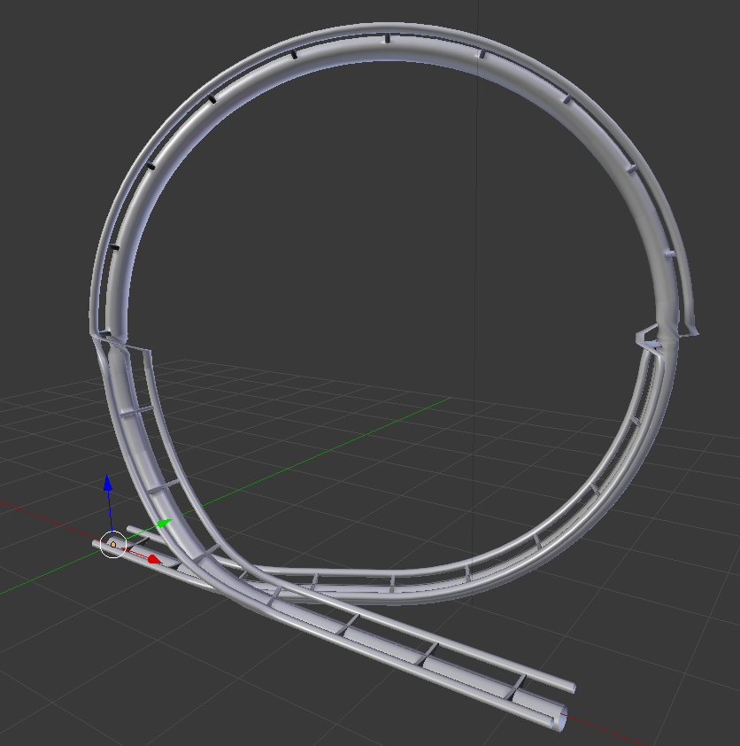

# Report Group 19
## Abstract
We implemented a 3D stochastic L-System procedural roller coaster as a Blender addon. The addon lets the user chose the number of iterations of the L-System and toggle the realistic twisting of the tracks. In addition to that there is a button that performs the next iteration of the L-System (without having to recompute everything from scratch).

## Technical Approach
### Summary
The use of an L-System to build a somewhat realistic roller coaster made us use a few technical implementations. First, we needed a 3D L-System which we took from the assignment 7 of the course and translated it in python. We have implemented different symbols for each possible angle ($\pm$ vertical and $\pm$ horizontal). In addition to that, we need some symbol to compute the distance that the line will have to travel, depending on its angle.

Then, we wanted to have a stochastic system, so that we could have different result each time. We then added a parameter to the symbols that give the probability that they are chosen at the next iteration (we have to be careful that probabilities sum to 1 !). However, not every symbol has to be stochastic (for example angles, fixed lengths, etc), so that we can build predefined rules and have a track that doesn't get messed up. Those rules are predefined lists of symbols,that are used to have control on the way the L-System evolve. Furthermore, we can compute with them some tracks that would not happen if there are no rules like those (or with a really really low probability), such as loopings, for example.

Because the rules where made by us we had complete control over what they had to look like. The main challenge was to start with a track that loops and keep this property after each iteration. This was achieved by designing the rules such that the end point would be at some fixed length in front of the starting point, and the angle at the end point would be constant for these rules. With this, no matter what symbol gets replaced by the stochastic system, the loop property would remain.

There are then both implemented extensions, where we computed some twists on the tracks, some coming directly from the L-System on a stochastic manner, some based on a physical approach, with the goal to twist tracks depending on the centrifugal force a wagon would get while running it. To do that, we computed the difference of horizontal angle at each step

### Problems encountered
- We struggled with Blender in order to make the loopings realistic. Even if they weren't mandatory it was a personal achievement that we wanted to complete. The problem was that Blender allow us to choose between 3 modes of drawing a curve (for a NURBS curve in our case): tangeant (which is useless for us), minimum (which twists the curve slightly whenever there is a slight turn) and z-up (which keeps the z direction upwards). Because we needed to have control over the curvature of the tracks (i.e. being able to manually twist each point of the curve) we didn't want to use the minimum option because we had no way of telling how blender had twisted the curve to then compensate it. However, using the z-up mode would totally mess our loopings as you can see below (_Figure 1.a_).
 
- Some rules could interact badly with each other (cf _Figure 1.b_), we then had to carefully choose which rule can be called by another one. To be able to do that, we separated rules in different categories, for example ones that begin with a turn to the right, those that turn to the left, etc. Then, more stochastic symbols had to be implemented, so that it can differentiates which exact rule to call, depending on what happens before and after it.
 
- Twists are managed in a strict way in Blender, in the sense that $2n\pi$ rotations (for $n>1$) are not equal to $0$ or $2\pi$ ones. That is, if we have for example a rotation of 360° adjacent to a 0°, Blender will make a rotation of -360° over a single point, to match both side (cf. _Figure 1.c_). To resolve this

 |  | 
--- | ---
*Figure 1: A messed up looping*  | *Figure 2: sharp turn issue* | *Figure 3: realistic twist with random twist issue*

## Results

## How to run the code

## Contributions
Lucas Strauss (*33.33%*): mainly worked on the Blender side (addon and render) and the physically based twisting.

Joachim Dunant (*33.33%*): mainly focused on the rules and probabilities as well as the L-System implementation.

Lucien Iseli (*33.33%*): mainly worked on the L-System implementation.

Each team member worked on every part of the project and helped each other whenever they could.

## References
(Our references did not change since the last report)

`Blender` to create the track, and to render the final scene.

`Python` to code the algorithm for Blender.

Assignment 8 of the course.

http://pcgbook.com/
https://ieeexplore.ieee.org/document/8627334
https://docs.blender.org/api/2.79/
